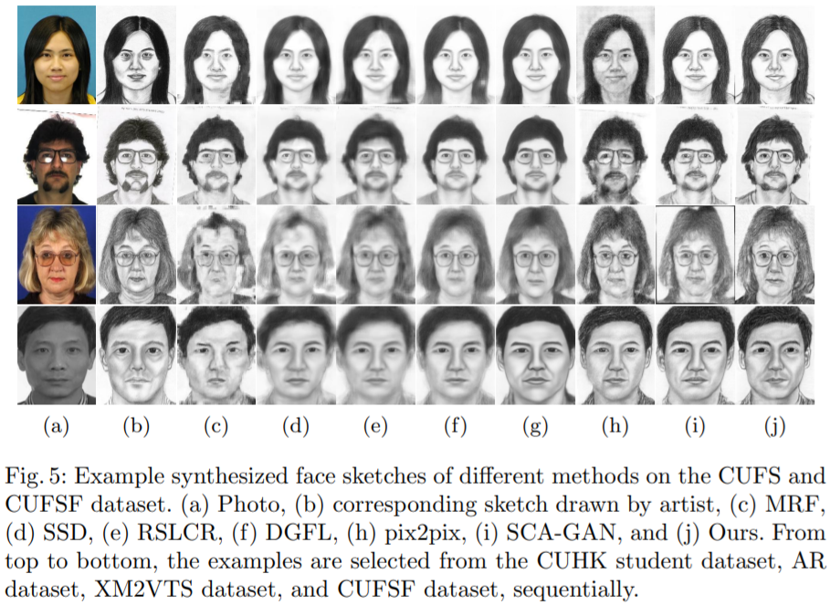

# A Consistency Enhanced Deep Lmser Network for Face Sketch Synthesis
---
Existing face sketch synthesis methods extend conditional generative adversarial network framework with promising performance. However, they usually pre-train on additional large-scale datasets, and the performance is still not satisfied. To tackle the issues, we develop a deep bidirectional network based on the least mean square error reconstruction (Lmser) self-organizing network, which is a further development of autoencoder by folding along the central hidden layer. Such folding makes the neurons on the paired layers between encoder and decoder merge into one. We model the photo-to-sketch mapping by an Lmser network and build a sketch-to-photo mapping by a complement Lmser sharing the same structure. The bidirectional mappings form an alternation system. We devise a supervised alternating consistency for the system, by minimizing the deviation between the alternatively mapped pattern and the ground-truth. Enhanced by the consistency constraints along the bidirectional paths, the model achieve a significant improvement in terms of Fr\'echet Inception Distance (FID). Experiments demonstrate the effectiveness of our method in comparison with state-of-the-art methods, and reduce the FID from 34.1 to 28.7 on the CUFS dataset and from 18.2 to 11.5 on the CUFSF dataset.

This repository holds the Python implementation of the method described in the paper published in PRICAI 2021.

Qingjie Sheng, Shikui Tu*, Lei Xu*. "A Consistency Enhanced Deep Lmser Network for Face Sketch Synthesis". In Pacific Rim International Conference on Artificial Intelligence, pp. 127-138(2021). Springer, Cham.


---
## Content
1. [Requirements](#Requirements)
2. [Datasets](#Datasets)
3. [Training](#Training)
5. [Acknowledgement](#Acknowledgement)

---
## Requirements
- Python 3.6 or higher.
- Pytorch == 1.2.0.
- TensorFlow-gpu >= 1.14.0
- ...

---
## 
You can download the datasets from the following websites.
1. [CUFS](http://mmlab.ie.cuhk.edu.hk/archive/facesketch.html)
2. [CUFSF](http://mmlab.ie.cuhk.edu.hk/archive/cufsf/)

---
## Training
As an example, after putting data source file to the data folder, you can simply run:

`python train_sc_lmser.py --gpu "0,1" --data_type CUFS --sub_node sclmser_cufs --resume_training 1`

Some of the available arguments are:

| Argument          | Description                                                | Default                     | Type  |
| ----------------- | ---------------------------------------------------------- | --------------------------- | ----- |
| `--data_dir`        | The directory of sketch data of the dataset              | ---                  | str   |
| `--log_root`    | Directory to store print log                                 | ---                 | str   |
| `--data_type`        | The datasets : cufs or cufsf                                           | cufs                        | str   |
| `--snapshot_root`             | Directory to store model checkpoints| ---               | str   |
| `--resume_training`    | Set to true to load previous checkpoint                                 | False                          | bool   |
| `--sub_node`            | Subnode for saving models and results          | sclmser_cufs                    | float |
| `--gpu`         | Gpu device for training or testing           | 1                       | str |

For more details, you can read option.py.

## Acknowledgement
This project would not have been finished without using the codes or files from the following open source projects:
1. The code for evaluating FSIM and NLDA is shared by prof. Wang Nannan.
2. The code for evaluating FID is inspired by [pytorch-fid](https://github.com/mseitzer/pytorch-fid).

## Reference
Please cite our work if you find our code/paper is useful to your work.

```
@inproceedings{sheng2021consistency,
  title={A Consistency Enhanced Deep Lmser Network for Face Sketch Synthesis},
  author={Sheng, Qingjie and Tu, Shikui and Xu, Lei},
  booktitle={Pacific Rim International Conference on Artificial Intelligence},
  pages={127--138},
  year={2021},
  organization={Springer}
}
```
